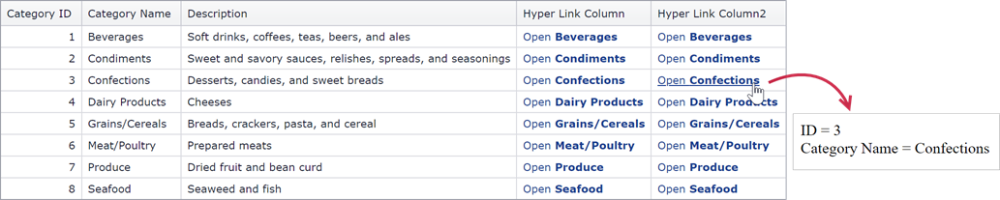

<!-- default badges list -->

[](https://supportcenter.devexpress.com/ticket/details/T517626)
[](https://docs.devexpress.com/GeneralInformation/403183)
<!-- default badges end -->

# Grid View for Web Forms - How to Create a HyperLink Column Whose URL Depends on Several Column Values

<!-- run online -->
**[[Run Online]](https://codecentral.devexpress.com/t517626/)**
<!-- run online end -->


This example demonstrates how to create a [GridViewDataHyperLinkColumn](https://docs.devexpress.com/AspNet/DevExpress.Web.GridViewDataHyperLinkColumn?p=netframework) whose URL depends on several column values. 



Specify the [GridViewDataColumn.UnboundExpression](https://docs.devexpress.com/AspNet/DevExpress.Web.GridViewDataColumn.UnboundExpression) property to create a column's URL:


```aspx
<dx:GridViewDataHyperLinkColumn FieldName="HyperLinkColumn" 
                                UnboundType="String"
                                UnboundExpression="'Default2.aspx?id='+[CategoryID]+'&name='+[CategoryName]" VisibleIndex="4">
    <PropertiesHyperLinkEdit TextField="CategoryName" 
                             DisplayFormatString="Open <b>{0}<b/>">
    </PropertiesHyperLinkEdit>
</dx:GridViewDataHyperLinkColumn>
```

Use the [HyperLinkProperties.NavigateUrlFormatString](https://docs.devexpress.com/AspNet/DevExpress.Web.HyperLinkProperties.NavigateUrlFormatString) property to add additional text to the complete URL:


```aspx
<dx:GridViewDataHyperLinkColumn FieldName="HyperLinkColumn2" 
                                UnboundType="String"
                                UnboundExpression="'?id='+[CategoryID]+'&name='+[CategoryName]" 
                                VisibleIndex="4">
    <PropertiesHyperLinkEdit TextField="CategoryName" 
                             DisplayFormatString="Open <b>{0}<b/>" 
                             NavigateUrlFormatString="Default2.aspx{0}">
    </PropertiesHyperLinkEdit>
</dx:GridViewDataHyperLinkColumn>
```

You can also configure a custom [DataItemTemplate](https://docs.devexpress.com/AspNet/DevExpress.Web.GridViewDataColumn.DataItemTemplate) to display links in cells. For more information, refer to the following page: [How to use a hyperlink whose argument depends on several cell values in the ASPxGridView](https://github.com/DevExpress-Examples/how-to-use-a-hyperlink-whose-argument-depends-on-several-cell-values-in-the-aspxgridview-e993).

## Files to Look At

* [Default.aspx](./CS/Default.aspx) (VB: [Default.aspx](./VB/Default.aspx))
* [Default2.aspx.cs](./CS/Default2.aspx.cs) (VB: [Default2.aspx.vb](./VB/Default2.aspx.vb))

## Documentation

* [Grid View](https://docs.devexpress.com/AspNet/5823/components/grid-view)
* [Grid View - Unbound Columns](https://docs.devexpress.com/AspNet/114140/components/card-view/concepts/data-representation-basics/columns/unbound-columns?p=netframework).
* [GridViewDataHyperLinkColumn](https://docs.devexpress.com/AspNet/DevExpress.Web.GridViewDataHyperLinkColumn?p=netframework)

## More Examples

* [How to use a hyperlink whose argument depends on several cell values in the ASPxGridView](https://github.com/DevExpress-Examples/how-to-use-a-hyperlink-whose-argument-depends-on-several-cell-values-in-the-aspxgridview-e993)
* [ASPxGridView - How to display a popup using GridViewDataHyperLinkColumn and its NavigateUrlFormatString property](https://github.com/DevExpress-Examples/aspxgridview-how-to-display-a-popup-using-gridviewdatahyperlinkcolumn-and-its-navigateurlfor-e2193)
* [How to show popup by clicking a hyperlink in grid column's DataItemTemplate](https://github.com/DevExpress-Examples/how-to-show-popup-by-clicking-a-hyperlink-in-grid-columns-dataitemtemplate-e2270)
* [How to create and configure a HyperLink column at runtime](https://github.com/DevExpress-Examples/how-to-create-and-configure-a-hyperlink-column-at-runtime-e308)
* [How to change styles for a hyperlink column](https://github.com/DevExpress-Examples/how-to-change-styles-for-a-hyperlink-column-e2661)
